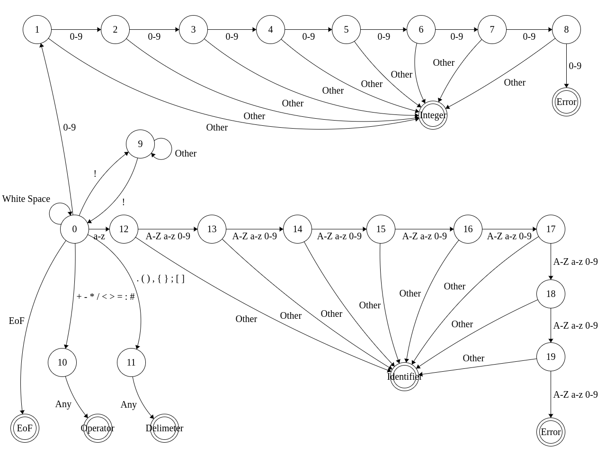

# Scanner

> The first stage of compiling, the scanner, is usually based on a finite-state machine (FSM). It has encoded within it information on the possible sequences of characters that can be contained within any of the tokens it handles (individual instances of these character sequences are termed lexemes). For example, an integer token may contain any sequence of numerical digit characters. In many cases, the first non-whitespace character can be used to deduce the kind of token that follows and subsequent input characters are then processed one at a time until reaching a character that is not in the set of characters acceptable for that token (this is termed the maximal munch, or longest match, rule). In some languages, the lexeme creation rules are more complex and may involve backtracking over previously read characters. For example, in C, one 'L' character is not enough to distinguish between an identifier that begins with 'L' and a wide-character string literal.

From [Wikipedia](https://en.wikipedia.org/wiki/Lexical_analysis).

## How to Run
1. `make`
2. `./scanner filename`

## Deterministic Finite Automaton

To edit import `assets/deterministic-finite-automaton.json` at https://merfoo.github.io/fsm/

## State Transition Table

The following table is located at `src/scanner/state_transition_table/state_transition_table.cpp`.

The function corresponding to the finite automaton driver is `Scanner::read()` in `src/scanner/scanner.cpp`.

To edit import `assets/state-transition-table.csv` into your favorite spreadsheet program.

| 0-9         | !            | + - * / < > = | : # . ( ) , { } ; [ ] | a-z         | A-Z         | EoF          | White Space  | 
|-------------|--------------|---------------|-----------------------|-------------|-------------|--------------|--------------| 
| 1           | 9            | 10            | 11                    | 12          | Error       | EoFTk        | 0            | 
| 3           | IntegerTk    | IntegerTk     | IntegerTk             | IntegerTk   | IntegerTk   | IntegerTk    | IntegerTk    | 
| 2           | IntegerTk    | IntegerTk     | IntegerTk             | IntegerTk   | IntegerTk   | IntegerTk    | IntegerTk    | 
| 4           | IntegerTk    | IntegerTk     | IntegerTk             | IntegerTk   | IntegerTk   | IntegerTk    | IntegerTk    | 
| 5           | IntegerTk    | IntegerTk     | IntegerTk             | IntegerTk   | IntegerTk   | IntegerTk    | IntegerTk    | 
| 6           | IntegerTk    | IntegerTk     | IntegerTk             | IntegerTk   | IntegerTk   | IntegerTk    | IntegerTk    | 
| 7           | IntegerTk    | IntegerTk     | IntegerTk             | IntegerTk   | IntegerTk   | IntegerTk    | IntegerTk    | 
| 8           | IntegerTk    | IntegerTk     | IntegerTk             | IntegerTk   | IntegerTk   | IntegerTk    | IntegerTk    | 
| Error       | IntegerTk    | IntegerTk     | IntegerTk             | IntegerTk   | IntegerTk   | IntegerTk    | IntegerTk    | 
| 9           | 0            | 9             | 9                     | 9           | 9           | 9            | 9            | 
| OperatorTk  | OperatorTk   | OperatorTk    | OperatorTk            | OperatorTk  | OperatorTk  | OperatorTk   | OperatorTk   | 
| DelimeterTk | DelimeterTk  | DelimeterTk   | DelimeterTk           | DelimeterTk | DelimeterTk | DelimeterTk  | DelimeterTk  | 
| 13          | IdentifierTk | IdentifierTk  | IdentifierTk          | 13          | 13          | IdentifierTk | IdentifierTk | 
| 14          | IdentifierTk | IdentifierTk  | IdentifierTk          | 14          | 14          | IdentifierTk | IdentifierTk | 
| 15          | IdentifierTk | IdentifierTk  | IdentifierTk          | 15          | 15          | IdentifierTk | IdentifierTk | 
| 16          | IdentifierTk | IdentifierTk  | IdentifierTk          | 16          | 16          | IdentifierTk | IdentifierTk | 
| 17          | IdentifierTk | IdentifierTk  | IdentifierTk          | 17          | 17          | IdentifierTk | IdentifierTk | 
| 18          | IdentifierTk | IdentifierTk  | IdentifierTk          | 18          | 18          | IdentifierTk | IdentifierTk | 
| 19          | IdentifierTk | IdentifierTk  | IdentifierTk          | 19          | 19          | IdentifierTk | IdentifierTk | 
| Error       | IdentifierTk | IdentifierTk  | IdentifierTk          | Error       | Error       | IdentifierTk | IdentifierTk | 

